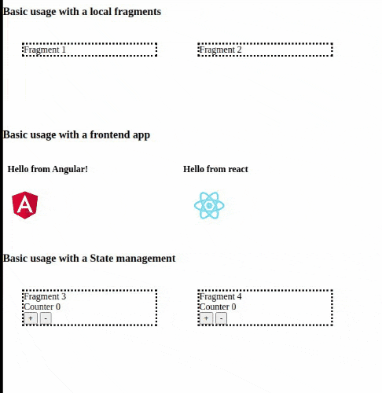

# Web Merge

Declarative client-side web fragments (apps/files) merger using web component APIs

## NOTE
> EXPERIMENTAL DO NOT USE IN PRODUCTION


## Installation

## 1. via npm

```shell
$ npm install @soubai/web-merge
# or

$ yarn add @soubai/web-merge
```

Then import it in your script


```js
import '@soubai/web-merge'
```

## 2. via unpkg

```html
<script type="module" src="unpkg.com/@soubai/web-merge"></script>
```


## Usage

use `<web-merge>` element to load you fragment into web page

```html
<web-merge content="./fragments/fragment-1.html"></web-merge>

<web-merge content="./fragments/fragment-2.html"></web-merge>
```

### Attributes 

**content**: define the source of you fragments (files,urls ...)
```html

<web-merge content="./fragments/fragment-1.html"></web-merge>


<web-merge content="http://localhost:3000"></web-merge>

```


**lazy**: allow lazy loading for a fragment 

```html
<web-merge lazy content="./fragments/fragment-1.html"></web-merge>
```
### State management

Web-merge includes a build-in simple state management system based on event (not Event bus).

The fragment `parent` expose a state object that can help you to mutate and get new store 

```js
        
// fragment-3.html

const { state } = parent;

//initial state 

state.init({ count: 0 })

//event name 

const COUNT_CHANGE = "countChange";

//Apply side effects 
state.on(COUNT_CHANGE, ({ count }) => {
    document.querySelector("span.value").textContent = count;
});

//mutations 

document.getElementById("inc").addEventListener("click", function () {
    state.dispatch(COUNT_CHANGE, ({ count }) => ({ count: count + 1 }));
        });

document.getElementById("dec").addEventListener("click", function () {
    state.dispatch(COUNT_CHANGE, ({ count }) => ({ count: count - 1 }));
});

```



